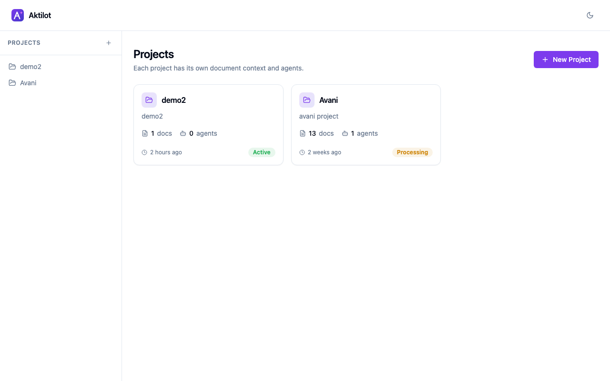
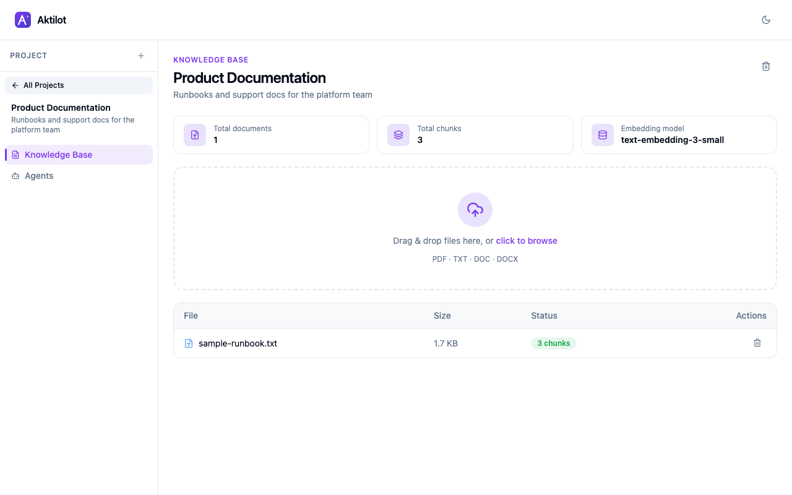
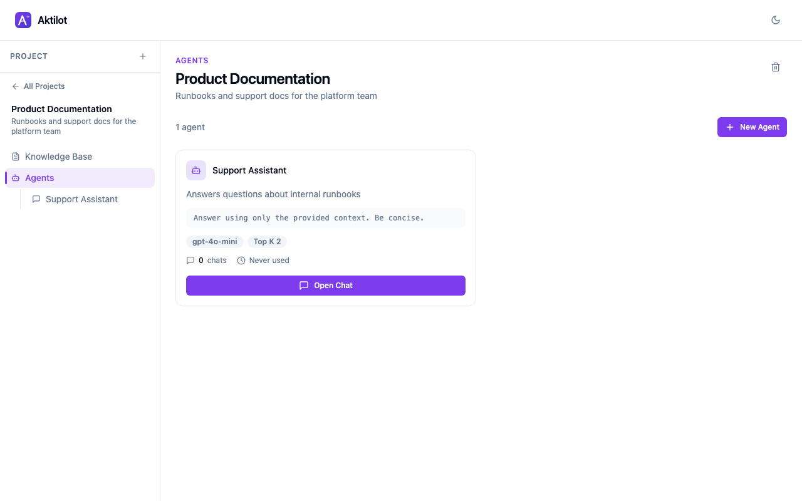
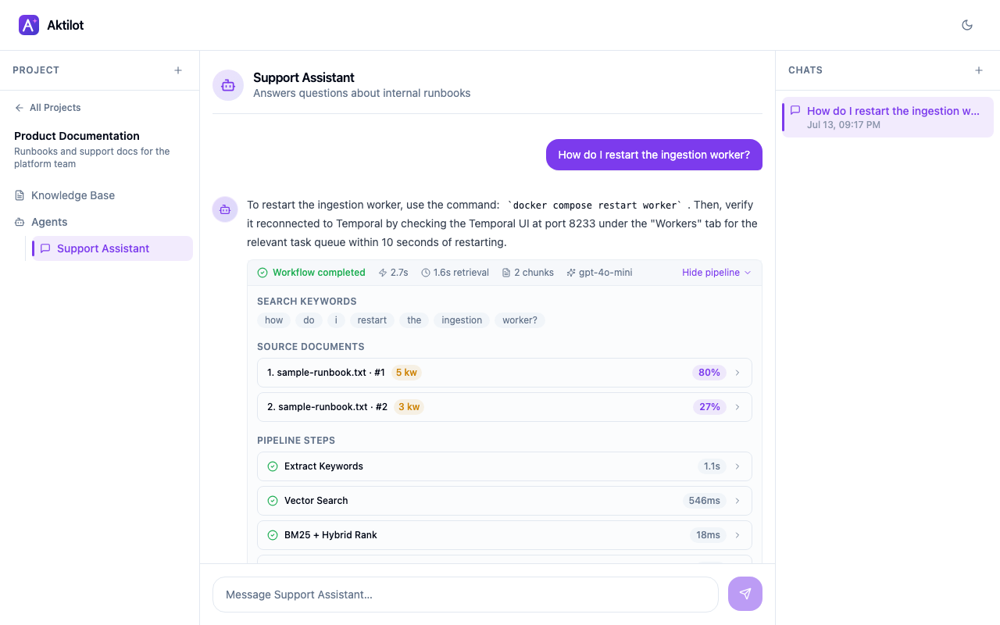
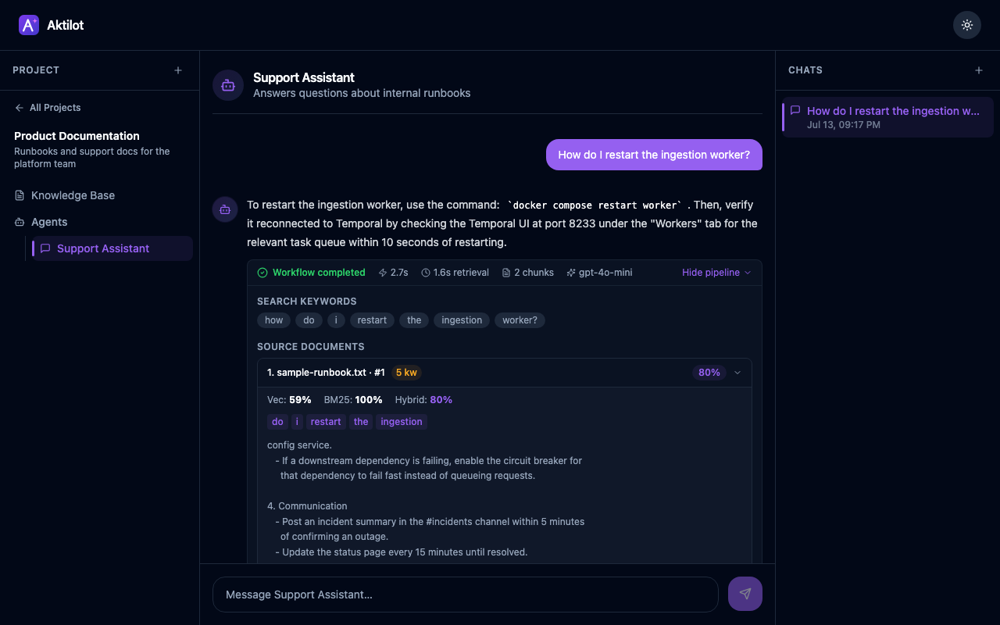

<div align="center">

# Aktilot

**Chat with your documents. On your infrastructure. No data leaves your servers.**

[](LICENSE)
[](CONTRIBUTING.md)

</div>

---

## The Problem

Your team has documents everywhere — contracts, reports, runbooks, research papers — and finding answers means either manually digging through files or paying for a hosted AI service that ingests your sensitive data.

Hosted document AI tools are expensive, opaque, and require you to hand over your files to a third party. Building your own RAG pipeline from scratch means weeks of engineering work just to get a working prototype.

**Aktilot fills that gap.** It's a self-hosted, open-source platform that lets you upload your documents and ask questions in plain English — in minutes, not weeks, with your data staying exactly where it is.

---

## What Aktilot Does

**Organize your knowledge into projects.**
Group documents by team, client, or use case. Each project gets its own isolated vector store, so a query against your legal documents never bleeds into your engineering runbooks.

**Create AI agents that know their role.**
Each agent has a configurable system prompt, persona, and retrieval depth (`top_k`). Your customer-facing support bot and your internal audit agent can live in the same project and behave completely differently.

**Upload any document — PDF, Word, or plain text.**
Drop in a file and Aktilot handles the rest: splitting it into overlapping chunks, embedding each chunk via OpenAI, and indexing it into ChromaDB. The UI shows you live processing status so you always know where a file stands.

**Ask questions, get answers with sources.**
Every response includes the exact document chunks it was built from — filename, chunk position, and relevance score. No hallucination hiding behind a confident tone; you can trace every answer back to a sentence.

**See every step of the retrieval pipeline.**
The UI exposes the full pipeline trace for each query: which keywords were extracted, how many candidates came back from vector search, how they were re-ranked, what context was assembled, and how long each step took. Nothing is a black box.

**Resilient by design — not by accident.**
Document ingestion and chat both run as durable Temporal workflows. Every activity is checkpointed. If OpenAI rate-limits you mid-pipeline, only the failed step retries automatically — the work already done is not repeated and no API credits are wasted.

**Runs entirely on your infrastructure.**
Postgres, ChromaDB, and the worker all run in Docker. Your documents never leave your network. You control the OpenAI key, the storage, and the retention policy.

> Aktilot uses a hybrid BM25 + vector retrieval approach — combining keyword overlap scoring with semantic similarity — which consistently outperforms pure vector search on precise factual questions like dates, names, and figures.

---

## How It Works


All three workflows run on a **Temporal Cluster** for durable, individually-retryable execution:

- **DocumentWorkflow** — chunks, embeds, and indexes uploaded files into ChromaDB. Metadata is stored in Postgres.
- **ChatWorkflow** — hybrid BM25 + vector retrieval, LLM answer generation, and conversation persistence. Each step is checkpointed; a failed OpenAI call retries alone without re-running earlier steps.
- **BenchmarkWorkflow** *(coming soon)* — evaluates retrieval quality with Recall@K, MRR, and latency metrics, storing results in an evaluation DB.

---

## Demo

A 35-second, end-to-end walkthrough — create a project, upload a document, spin up an agent, and ask it a question with real hybrid-retrieval sources and Temporal workflow timing.


*(GIF for inline preview — [watch the full-quality MP4](docs/demo.mp4).)*

---

## Screenshots

<table>
  <tr>
    <td><br/><sub>Projects</sub></td>
    <td><br/><sub>Knowledge Base</sub></td>
  </tr>
  <tr>
    <td><br/><sub>Agents</sub></td>
    <td><br/><sub>Chat — sources & workflow trace</sub></td>
  </tr>
  <tr>
    <td colspan="2"><br/><sub>Chat — dark mode</sub></td>
  </tr>
</table>

---

## Getting Started

The fastest way to run Aktilot is with Docker Compose. You need an [OpenAI API key](https://platform.openai.com/api-keys) and Docker installed.

```bash
git clone https://github.com/vikas0686/aktilot.git
cd aktilot

cp .env.example .env
# Open .env and set: OPENAI_API_KEY=sk-...

docker compose up --build
```

| Service | URL | Purpose |
|---|---|---|
| App | http://localhost:3000 | Main UI |
| Backend API | http://localhost:8000 | REST API + OpenAPI docs at `/docs` |
| Temporal UI | http://localhost:8233 | Workflow execution history and retries |
| Grafana | http://localhost:3002 | Observability dashboards (admin / admin) |
| Prometheus | http://localhost:9090 | Metrics query engine |

That's it. Create a project, upload a PDF, create an agent, and start asking questions.

The Temporal UI at `:8233` lets you monitor document processing jobs, inspect individual pipeline steps, and retry failed uploads without re-uploading the file.

---

## Local Development

**Prerequisites:** Python 3.12+, Node 20+, Docker (for Postgres + Temporal)

**Backend**

```bash
cd backend
python3 -m venv .venv && source .venv/bin/activate
pip install -r requirements.txt

cp .env.example .env   # set OPENAI_API_KEY and DATABASE_URL

# Start Postgres and Temporal via Docker
docker compose up postgres temporal -d

alembic upgrade head

# Terminal 1 — API server
uvicorn main:app --reload --port 8000

# Terminal 2 — Temporal worker (processes document uploads)
python -m temporal.worker
```

**Frontend**

```bash
cd frontend
npm install
npm run dev   # http://localhost:5173
```

**Tests**

```bash
# Backend
cd backend && source .venv/bin/activate
pytest --tb=short -q

# Frontend
cd frontend && npm test
```

---

## Environment Variables

| Variable | Required | Description |
|---|---|---|
| `OPENAI_API_KEY` | Yes | Your OpenAI API key |
| `DATABASE_URL` | Yes | PostgreSQL connection string (asyncpg) |
| `TEMPORAL_ADDRESS` | No | Temporal server address (default: `localhost:7233`) |
| `CHAT_MODEL` | No | Chat model to use (default: `gpt-4o-mini`) |
| `EMBEDDING_MODEL` | No | Embedding model (default: `text-embedding-3-small`) |
| `UPLOAD_DIR` | No | Where uploaded files are stored (default: `uploads`) |
| `CHROMA_DIR` | No | Where vector data is persisted (default: `chroma_data`) |

Copy `.env.example` to `.env` in the project root (for Docker) or `backend/.env` (for local dev).

---

## Observability

Aktilot ships with a full observability stack — metrics, traces, and 7 pre-built Grafana dashboards covering LLM performance, retrieval quality, token costs, prompt intelligence, vector database health, and Temporal workflow execution.

See **[OBSERVABILITY.md](OBSERVABILITY.md)** for the full dashboard guide, metrics reference, and service URLs.

---

## Contributing

We welcome contributions of all kinds — bug fixes, new features, documentation improvements, and feedback.

Read [CONTRIBUTING.md](CONTRIBUTING.md) for how to set up your dev environment, our branching workflow, code standards, and how to submit a pull request.

If you've found a bug, open an [issue](https://github.com/vikas0686/aktilot/issues). If you have a feature idea, start a [discussion](https://github.com/vikas0686/aktilot/discussions) before writing code.

For security vulnerabilities, please do not open a public issue — see [SECURITY.md](SECURITY.md).

---

## License

[MIT](LICENSE) © Vikas Pandey
